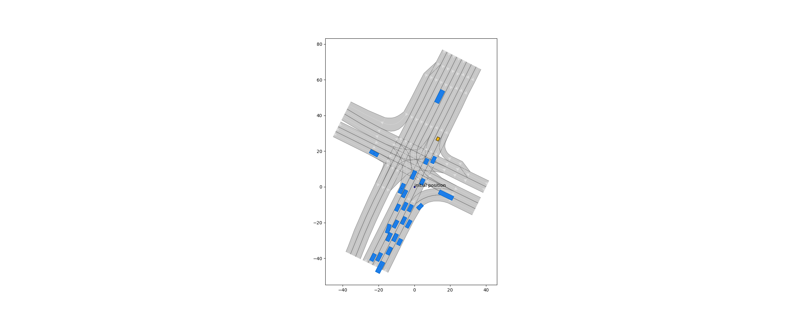
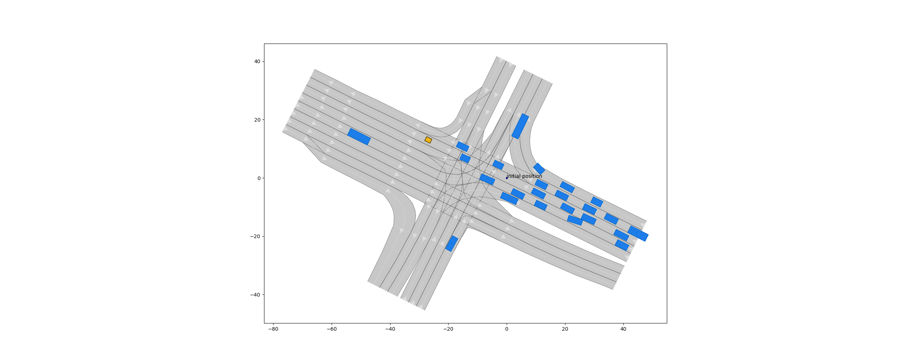

.. _getting_started:

===============
Getting Started
===============

This manual introduces the main functionality by means of some examples. Exact class descriptions can be found in the module descriptions.

`CommonRoad XML-files <https://commonroad.in.tum.de/scenarios/>`_ consist of a :class:`.Scenario` and a :class:`.PlanningProblemSet`. A :class:`.Scenario` represents the environment including a :class:`.LaneletNetwork` and a set of :class:`.DynamicObstacle` and :class:`.StaticObstacle`. A :class:`.LaneletNetwork` is built from lane segments (:class:`.Lanelet`), that can be connected arbitrarily.
A :class:`.PlanningProblemSet` contains one :class:`.PlanningProblem` for every ego vehicle in the :class:`.Scenario`, consisting of an initial :class:`.State` and a :class:`.GoalRegion` that has to be reached.

For detailed information, see `XML CommonRoad Documentation <https://commonroad.in.tum.de/documentation/xml_format_doc/>`_.

Reading Files 
-------------
Description: :class:`commonroad.common.file_reader`.

The :class:`.CommonRoadFileReader` reads the :class:`.Scenario` and the :class:`.PlanningProblemSet` from a CommonRoad XML-file:

.. code-block:: python

	import os
	import matplotlib.pyplot as plt

	from commonroad.common.file_reader import CommonRoadFileReader
	from commonroad.visualization.draw_dispatch_cr import draw_object

	file_path = os.path.join(os.getcwd(), 'scenarios/NGSIM/Lankershim/USA_Lanker-1_1_T-1.xml')

	scenario, planning_problem_set = CommonRoadFileReader(file_path).open()

	plt.figure(figsize=(25, 10))
	draw_object(scenario)
	draw_object(planning_problem_set)
	plt.gca().set_aspect('equal')
	plt.show()

   An intersection scenario *USA_Lanker-1_1_T-1* from CommonRoad

Per default, the first time step of the scenario is plotted. Please note that within all modules of CommonRoad the time is discretized and only discrete time steps are used.
To plot the scenario at another time index, draw parameters can be defined:

.. code-block:: python

	draw_parameters = {'time_begin': 10}

	plt.figure(figsize=(25, 10))
	draw_object(scenario, draw_params=draw_parameters)
	draw_object(planning_problem_set)
	plt.gca().set_aspect('equal')
	plt.show()

For more details on plotting options see :ref:`Visualization Manual <visualization-manual>`.

Scenario
--------
Description: :class:`commonroad.scenario.scenario`.

Reading a CommonRoad XML-file with the :class:`.CommonRoadFileReader` returns an instance of class :class:`.Scenario`. This instance contains all information about the road network and surrounding obstacles.

Additionally, the scenario can be modified or new scenarios can be created.

E.g. scenarios can be translated and rotated:

.. code-block:: python

	import numpy as np

	translation = np.array([0.0, 0.0])
	angle = np.pi/2

	scenario.translate_rotate(translation, angle)
	planning_problem_set.translate_rotate(translation, angle)

	plt.figure(figsize=(25, 10))
	draw_object(scenario)
	draw_object(planning_problem_set)
	plt.gca().set_aspect('equal')
	plt.show()

   
   scenario rotated 90 deg counter-clockwise

Note that all other objects (obstacles, lanelets, planning problems, goal regions, occupancies, trajectories, ...) can be translated and rotated as well.

Other useful methods for trajectory planning are:

- :meth:`.Scenario.add_objects`
- :meth:`.Scenario.remove_obstacle`
- :meth:`.Scenario.occupancies_at_time_step`
- :meth:`.Scenario.obstacles_by_position_intervals`

Lanelet Network
^^^^^^^^^^^^^^^
Description: :class:`commonroad.scenario.lanelet`.

Each :class:`.Lanelet` stores its left and right boundary and its center by a polyline (a list of vertices).
If a lanelet A is the successor of another lanelet B, the first (center/left/right) point of A coincides with the last (center/left/right) point of B. More necessary conditions on lanelets can be found in the `XML CommonRoad Documentation <https://commonroad.in.tum.de/documentation/xml_format_doc/>`_.

Useful methods for trajectory planning are:

- :meth:`.LaneletNetwork.find_lanelet_by_id`
- :meth:`.LaneletNetwork.lanelets_in_proximity`

Obstacles
^^^^^^^^^
Description: :class:`commonroad.scenario.obstacle`

Obstacles in CommonRoad have an unique ID, an :class:`.ObstacleRole` (static or dynamic), an :class:`.ObstacleType` (e.g. car, pedestrian, parked vehicle, construction zone, ...), a :class:`.Shape` (e.g. rectangle, polygon, ...), and an initial :class:`.State`.

While a :class:`.StaticObstacle` is only described by those attributes, a :class:`.DynamicObstacle` has additionally a :mod:`.prediction` that defines its predicted dynamic behavior.

Useful methods for trajectory planning are:

- :meth:`.StaticObstacle.occupancy_at_time`
- :meth:`.DynamicObstacle.occupancy_at_time`

Dynamic Obstacle Prediction
---------------------------
Description: :class:`commonroad.prediction.prediction`.

Every :class:`.DynamicObstacle` has a :class:`.TrajectoryPrediction` or a :class:`.SetBasedPrediction`.
Each prediction contains an :class:`.Occupancy` set that represents the two-dimensional occupancy of the obstacle over time.

Each of the given `XML scenarios <https://commonroad.in.tum.de/scenarios/>`_ provides exactly one type of prediction for all dynamic obstacles.

Trajectory Prediction
^^^^^^^^^^^^^^^^^^^^^
Description: :class:`.TrajectoryPrediction`.

This prediction corresponds to the most likely trajectory of the obstacle. The :class:`.Trajectory` consists of a list of :class:`.State` and an initial time step.
The occupancy is calculated by forwarding the :mod:`.shape` of the :class:`.Obstacle` along the :class:`.Trajectory`.

Set Based Prediction
^^^^^^^^^^^^^^^^^^^^
Description: :class:`.SetBasedPrediction`.

This prediction stores the occupied area of the obstacle over time as bounded sets.

Planning Problems
-----------------
Description: :class:`.PlanningProblem`.

To solve a scenario, one has to find solutions to all problems in the :class:`.PlanningProblemSet`. Every :class:`.PlanningProblem` corresponds to one ego vehicle.
It consists of an initial state for the ego vehicle and a :class:`.GoalRegion` which the ego vehicle has to reach.
A :class:`.GoalRegion` is a collection of different goal states (e.g. position region in form of an arbitrary :class:`.Shape` or a list of :class:`.Lanelet` objects, velocity interval, time interval, orientation interval,...). 

Checking if a :class:`.GoalRegion` is reached works as follows:

.. code-block:: python

	from commonroad.planning.goal import GoalRegion
	from commonroad.common.util import Interval, AngleInterval
	from commonroad.scenario.trajectory import State

	# define example goal region
	goal_state_1 = State(time_step=Interval(3, 5), orientation=AngleInterval(0.1, 1), velocity=Interval(20, 30.5))
	goal_state_2 = State(time_step=Interval(3, 6), orientation=AngleInterval(0.1, 1), velocity=Interval(15, 25.5))

	goal_region = GoalRegion([goal_state_1, goal_state_2])

	# state of the ego vehicle
	state = State(time_step=3, orientation=0.5, velocity=25)

	# check if the state is inside of the goal region
	goal_region.is_reached(state)

Other useful methods:

- :meth:`.PlanningProblem.goal_reached`

Writing Files
-------------
Description: :class:`commonroad.common.file_writer`.

The :class:`.CommonRoadFileWriter` writes a :class:`.Scenario` and a :class:`.PlanningProblemSet` to a CommonRoad XML-file:

.. code-block:: python

	from commonroad.common.file_writer import CommonRoadFileWriter
	from commonroad.common.file_writer import OverwriteExistingFile

	fw = CommonRoadFileWriter(scenario, planning_problem_set, "author", "affiliation", "source", "tags")

	filename = "filename.xml"

	fw.write_to_file(filename, OverwriteExistingFile.ALWAYS)

Solution Writer
---------------
Description: :class:`commonroad.common.solution_writer`.

To upload a solution to https://commonroad.in.tum.de/ one can either submit data in form of a :class:`.Trajectory` or as a list of control inputs.
The :class:`.CommonRoadSolutionWriter` creates an XML file according to the given XML schema definition including an attribute with the correct benchmark ID. In order to do so, the scenario ID, the :class:`.VehicleType`, the :class:`.VehicleModel`, and the :class:`.CostFunction` have to be given.

A solution (trajectory or control input vector) can be written as XML file in the following way:

.. code-block:: python

	import os

	from commonroad.common.solution_writer import CommonRoadSolutionWriter, VehicleModel, VehicleType, CostFunction
	from commonroad.scenario.trajectory import Trajectory, State

	# prepare trajectory
	pm_state_list = list()
	for i in range(10):
	    pm_state_list.append(State(**{'position': np.array([i, -i]), 'velocity': i*.2, 'velocity_y': i*0.001, 'time_step': i}))
	trajectory_pm = Trajectory(0, pm_state_list)

	# prepare control input vector (list of [x_acceleration, y_acceleration, time])
	pm_input_list = np.array([[1.0, 3.5, 0.0], [2.0, 2.5, 0.1], [3.0, 1.5, 0.2]])

	# write solution to a xml file
	csw = CommonRoadSolutionWriter(output_dir=os.getcwd(), scenario_id='test_scenario', step_size=0.1, 
		                       vehicle_type=VehicleType.BMW_320i, vehicle_model=VehicleModel.PM, 
		                       cost_function=CostFunction.SA1)
	# add trajectory solution
	csw.add_solution_trajectory(trajectory_pm, planning_problem_id=5)

	# or add control vector solution
	csw.add_solution_input_vector(pm_input_list, planning_problem_id=8)

	csw.write_to_file()

