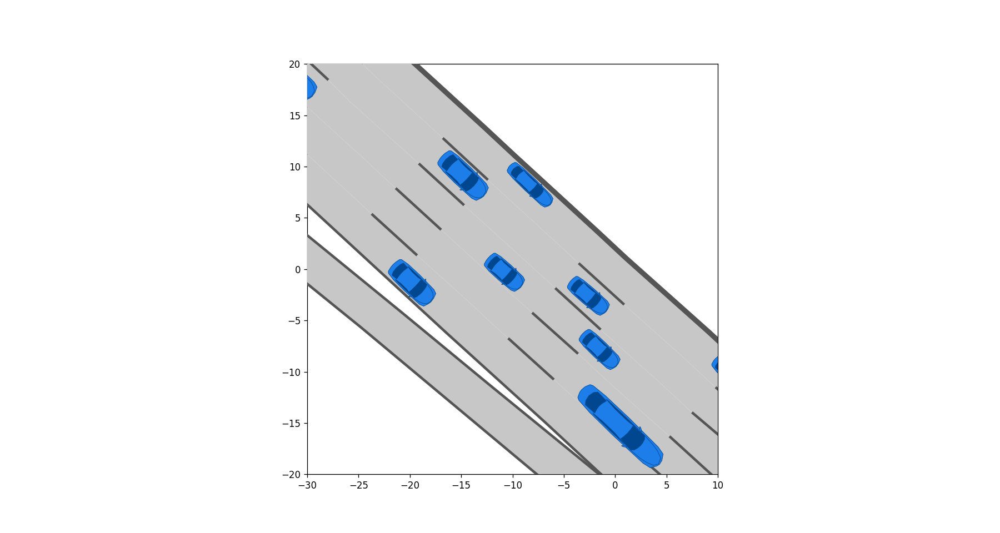

.. _visualization-manual:

====================
Visualization Manual
====================

.. _matplotlib: https://matplotlib.org
.. _`visitor pattern`: https://en.wikipedia.org/wiki/Visitor_pattern
.. _matplotlib-API: https://matplotlib.org/api

For the visualization of CommonRoad, we use the `visitor pattern`_. A visitor object, which we call *renderer* subsequently, has first to be instantiated. Afterward, the drawing function :meth:`~commonroad.visualization.drawable.IDrawable.draw` of the :class:`~commonroad.visualization.drawable.IDrawable` interface has to be called on all objects that should be visualized. All objects of the scenario and planning problems implement this function and can be individually drawn. Finally when all objects were drawn, :meth:`~commonroad.visualization.mp_renderer.MPRenderer.render` is called on the renderer to show the objects. Currently, matplotlib_ is the only supported rendering engine in CommonRoad. It is implemented in the :class:`~commonroad.visualization.mp_renderer.MPRenderer`-class.

Creating plots in CommonRoad
----------------------------
The drawing function is used in combination with matplotlib_. Therefore, the visualization of CommonRoad objects can be combined with standard matplotlib drawing functions. A simple example for plotting scenario and the corresponding planning problem set with default parameters would be::

    from commonroad.common.file_reader import CommonRoadFileReader
    from commonroad.visualization.mp_renderer import MPRenderer
    filename = 'path/to/scenario/USA_US101-2_1_T-1.xml'
    scenario, planning_problem_set = CommonRoadFileReader(filename).open()

    rnd = MPRenderer(figsize=(8,4.5))
    scenario.draw(rnd)
    planning_problem_set.draw(rnd)
    rnd.render()

.. plot::
   :align: center

    import os
    import matplotlib.pyplot as plt
    from commonroad.common.file_reader import CommonRoadFileReader
    from commonroad.visualization.mp_renderer import MPRenderer
    filename = os.getcwd() + '/../../../tests/test_scenarios/USA_US101-4_1_T-1.xml'
    scenario, planning_problem_set = CommonRoadFileReader(filename).open()
    rnd = MPRenderer(figsize=(8,4.5))
    scenario.draw(rnd)
    planning_problem_set.draw(rnd)
    rnd.render()

Styling options
---------------

The plotting style of the visualization module is defined by a :class:`~commonroad.visualization.draw_params.MPDrawParams` object.
For every drawable object, it contains a corresponding parameter object.

The :class:`~commonroad.visualization.draw_params.MPDrawParams` object can be either

-  set as the default parameters in the constructor of :class:`~commonroad.visualization.mp_renderer.MPRenderer`, or
-  by setting parameters on a per-object basis, when calling individual :meth:`~commonroad.visualization.drawable.IDrawable.draw` functions. Note, that the ladder overrides the former.

Example
"""""""
.. _`matplotlib colors`: https://matplotlib.org/stable/tutorials/colors/colors.html

We want to draw dynamic obstacles in a scenario with a green and individual dynamic obstacles in yellow. This can be achieved by modifying the following drawing parameters: ::

    scenario, planning_problem_set = CommonRoadFileReader(filename).open()
    rnd = MPRenderer(figsize=(8,4.5))
    rnd.draw_params.dynamic_obstacle.vehicle_shape.occupancy.shape.facecolor = "yellow"
    draw_params = DynamicObstacleParams()
    draw_params.vehicle_shape.occupancy.shape.facecolor = "green"
    scenario.draw(rnd)
    scenario.dynamic_obstacles[0].draw(rnd, draw_params)
    planning_problem_set.draw(rnd)
    rnd.render()

.. plot::
   :align: center

    import os
    import matplotlib.pyplot as plt
    from commonroad.common.file_reader import CommonRoadFileReader
    from commonroad.visualization.mp_renderer import MPRenderer
    from commonroad.visualization.draw_params import DynamicObstacleParams
    filename = os.getcwd() + '/../../../tests/test_scenarios/USA_US101-4_1_T-1.xml'
    scenario, planning_problem_set = CommonRoadFileReader(filename).open()
    rnd = MPRenderer(figsize=(8,4.5))
    rnd.draw_params.dynamic_obstacle.vehicle_shape.occupancy.shape.facecolor = "yellow"
    draw_params = DynamicObstacleParams()
    draw_params.vehicle_shape.occupancy.shape.facecolor = "green"
    scenario.draw(rnd)
    scenario.dynamic_obstacles[0].draw(rnd, draw_params)
    planning_problem_set.draw(rnd)
    rnd.render()

Note, that colors are specified as `matplotlib colors`_.

``plot_limits``
---------------

The drawn area of a scenario can be clipped by providing axes limits with :code:`plot_limits=[x_min, x_max, y_min, y_max]` to the renderer. In cases where performance matters, this option should be preferred over setting axes limits with :code:`pyplot.get_gca().set_xlim`. The latter would only crop the shown area of the scenario after drawing the whole scenario.

Creating videos in CommonRoad
-----------------------------

You can use :class:`~commonroad.visualization.mp_renderer.MPRenderer` to create a video of a scenario in mp4, gif, or avi format (see :meth:`~commonroad.visualization.mp_renderer.MPRenderer.create_video`).

Example
"""""""

We want to create a gif following the vehicle with ID 394 in the scenario. This can be achieved as follows: ::

    from commonroad.visualization.mp_renderer import MPDrawParams

    scenario, _ = CommonRoadFileReader(filename).open()
    rnd = MPRenderer()
    rnd.focus_obstacle_id = 394
    draw_params = MPDrawParams()
    draw_params.time_end = 25
    draw_params.dynamic_obstacle.show_label = False
    draw_params.dynamic_obstacle.draw_icon = True
    draw_params.dynamic_obstacle.draw_shape = True
    rnd.create_video([scenario], str(scenario.scenario_id) + ".gif", draw_params=draw_params)

